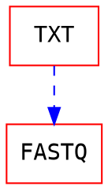
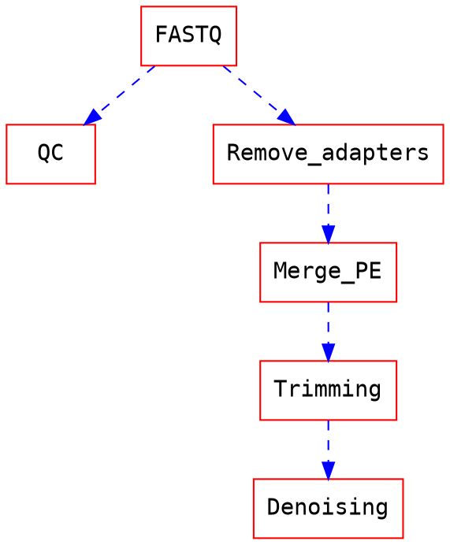

Open16S - Bioinformatique
===

> Author : orue 

https://demo.hedgedoc.org/features?both#

## Introduction

Ce document permet d'organiser le travail et les prises de notes du WP2 du projet MICA Open16S

### Organisation

* Forge :
* Répertoires de travail :
* 

## WP1 : Constituer et évaluer les jeux de données, évaluer leur pertinence

1. Livrable 1 : Sources des données, critères de choix des jeux de données à utiliser
1. Livrable 2 : Liste des écosystèmes et des jeux de données à sélectionner, INRAE ou non
1. Livrable 3 : Liste des Métadonnées à collecter
1. Livrable 4 : Critères pour évaluer la représentativité des jeux de données par écosystème

### Différences entre jeux de données impactant les analyses

- [x] Technologie de séquençage
- [x] Profondeur de séquençage
- [x] Primers utilisés

:::info
Un recensement des premiers jeux de données ciblés donnera des informations plus précises et chiffrées :spiral_note_pad: 
:::

## WP2 : Pipelines bioinfo et bases de données d’assignation taxonomique

### Livrable 1 : Définition d’un environnement de travail reproductible

Il est indispensable de travailler dans un environnement figé pour permettre à la fois la reproductibilité des analyses et éviter les soucis liés aux dépendances de packages R (entre autres) qui font planter les pipelines.

- [ ] environnement conda
- [ ] snakemake

### Livrable 2 : Définition d’un pipeline bioinfo jusqu'à la table de comptage

#### Téléchargement des données

Un premier workflow pourrait permettre de télécharger les données

* Inputs:
    * liste ?
* Outputs:
    * FASTQ
* Parameters:
    * None

#### Génération des ASVs

- Pear & dada2

> We do not recommend merging reads with PEAR prior to running dada2, and have speficially seen that this commonly causes problems. The issue is that the quality scores assigned by PEAR are not equivalent to those assigned by the sequencer (as suggested by your plot). [github issue](https://github.com/benjjneb/dada2/issues/434)

