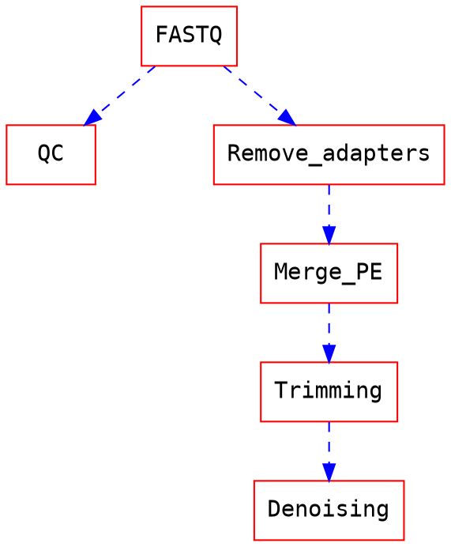

Open16S - Bioinformatique
===

# Introduction

Ce document permet d'organiser le travail et les prises de notes du WP2 du projet MICA Open16S

# WP2 : Pipelines bioinfo et bases de données d’assignation taxonomique

## Livrable 1 : Définition d’un environnement de travail reproductible

Il est indispensable de travailler dans un environnement figé pour permettre à la fois la reproductibilité des analyses et éviter les soucis liés aux dépendances de packages R (entre autres) qui font planter les pipelines.

## Livrable 2 : Définition d’un pipeline bioinfo jusqu'à la table de comptage

- Pear & dada2

> We do not recommend merging reads with PEAR prior to running dada2, and have speficially seen that this commonly causes problems. The issue is that the quality scores assigned by PEAR are not equivalent to those assigned by the sequencer (as suggested by your plot). [github issue](https://github.com/benjjneb/dada2/issues/434)

